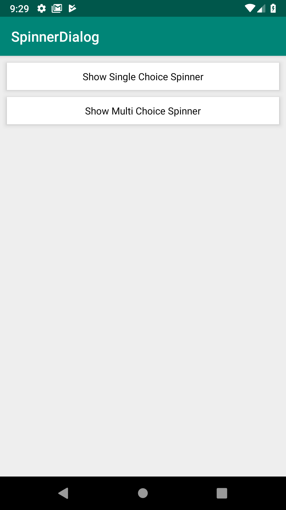
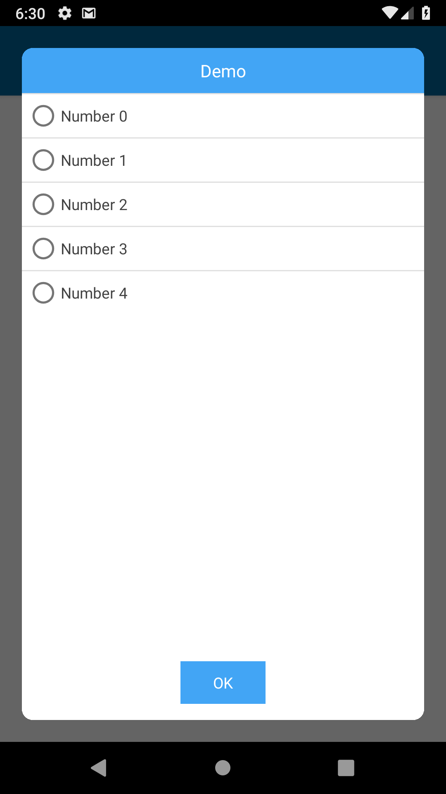
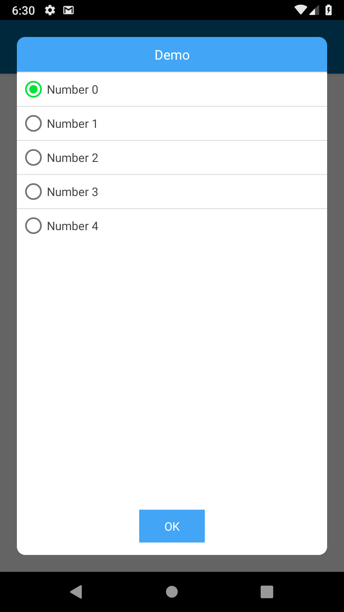
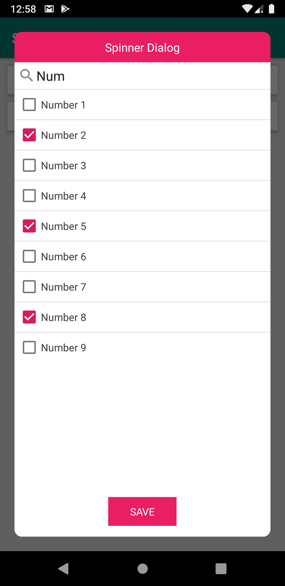

# SpinnerDialog
Android Spinner Dialog Library, Use for single or multi selection of choice

[](https://jitpack.io/#hamzaahmedkhan/SpinnerDialog)

[  ](https://bintray.com/hamzaahmedkhan/SpinnerDialog/SpinnerDialog/v1.0/link)


## Android UI













## Download

To include `SpinnerDialog` in your project, add the following to your dependencies:

**app/build.gradle**
```groovy
dependencies {
        implementation 'com.github.hamzaahmedkhan:SpinnerDialog:v1.2.0'
}
```

## Usage
The following snippet shows how you can use Spinner Dialog in your project.


**In Kotlin**

```kotlin
class MainActivity : AppCompatActivity() {


    override fun onCreate(savedInstanceState: Bundle?) {
        super.onCreate(savedInstanceState)
        setContentView(R.layout.activity_main)


        val arraySpinnerModel: ArrayList<SpinnerModel> = ArrayList()

        for (i in 1..9) {
            arraySpinnerModel.add(SpinnerModel("Number $i"))
        }


        // Init single select Fragment
        val spinnerSingleSelectDialogFragment =
            SpinnerDialogFragment.newInstance(
                SpinnerSelectionType.SINGLE_SELECTION,"Spinner Dialog", arraySpinnerModel,
                object :
                    OnSpinnerOKPressedListener {
                    override fun onSingleSelection(data: SpinnerModel, selectedPosition: Int) {
                        Toast.makeText(applicationContext, data.text, Toast.LENGTH_LONG).show()
                    }

                    override fun onMultiSelection(
                        data: List<SpinnerModel>,
                        selectedPosition: Int
                    ) {
                        // It will never send Multi selection data in SINGLE_SELECTION Mode
                    }

                }, 0
            )


        // Init multi select Fragment
        val spinnerMultiSelectDialogFragment =
            SpinnerDialogFragment.newInstance(
                SpinnerSelectionType.MULTI_SELECTION,"Spinner Dialog", arraySpinnerModel,
                object :
                    OnSpinnerOKPressedListener {
                    override fun onSingleSelection(data: SpinnerModel, selectedPosition: Int) {
                        Toast.makeText(applicationContext, data.text, Toast.LENGTH_LONG).show()
                    }

                    override fun onMultiSelection(
                        data: List<SpinnerModel>,
                        selectedPosition: Int
                    ) {
                        Toast.makeText(applicationContext, data.map { it.text }.joinToString(" - "), Toast.LENGTH_LONG).show()
                    }

                }, 0
            )


        txtShowSingleChoiceSpinner.setOnClickListener { spinnerSingleSelectDialogFragment.show(supportFragmentManager, "SpinnerDialogFragmentSingle") }
        txtShowMultiChoiceSpinner.setOnClickListener { spinnerMultiSelectDialogFragment.show(supportFragmentManager, "SpinnerDialogFragmentMulti") }
    }
}
```


**EXTRA ATTRIBUTES**
```kotlin

        // Using optional features for single select dialog
        spinnerSingleSelectDialogFragment.buttonText = "SAVE"
        spinnerSingleSelectDialogFragment.themeColorResId = resources.getColor(R.color.material_pink500)
        spinnerSingleSelectDialogFragment.showSearchBar = true
        spinnerSingleSelectDialogFragment.searchbarHint = "type here to search.."


        // Using optional features for multi select dialog
        spinnerMultiSelectDialogFragment.buttonText = "SAVE"
        spinnerMultiSelectDialogFragment.themeColorResId = resources.getColor(R.color.material_pink500)
        spinnerMultiSelectDialogFragment.showSearchBar = true
        spinnerMultiSelectDialogFragment.searchbarHint = "type here to search.."

```


**FUTURE PLANS**

-> Description option
