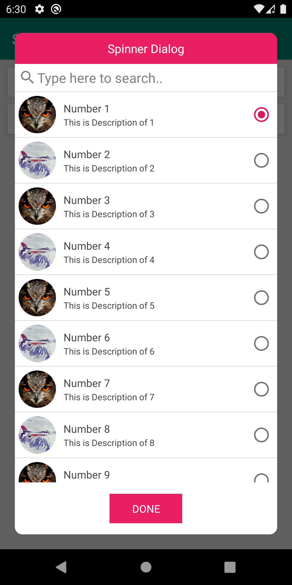
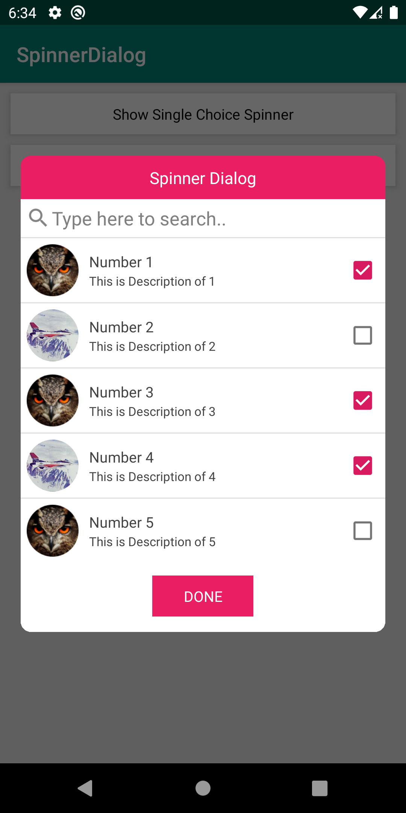

# SpinnerDialog
Android Spinner Dialog Library, Use for single or multi selection of choice

[](https://jitpack.io/#hamzaahmedkhan/SpinnerDialog)

[  ](https://bintray.com/hamzaahmedkhan/SpinnerDialog/SpinnerDialog/v1.2.3/link)


## Android UI







## Download

To include `SpinnerDialog` in your project, add the following to your dependencies:

**app/build.gradle**
```groovy
dependencies {
        implementation 'com.github.hamzaahmedkhan:SpinnerDialog:v1.2.3'
}
```

## Usage
The following snippet shows how you can use Spinner Dialog in your project.


**In Kotlin**

```kotlin
class MainActivity : AppCompatActivity() {


    override fun onCreate(savedInstanceState: Bundle?) {
        super.onCreate(savedInstanceState)
        setContentView(R.layout.activity_main)

        // INITIALZE DATA
        val arraySpinnerModel: ArrayList<SpinnerModel> = ArrayList()

        for (i in 1..9) {
            val spinnerModel = SpinnerModel(
                "Number $i"
            )
            spinnerModel.id = i
            arraySpinnerModel.add(
                spinnerMode
            )
        }


    // EXTRA PROPERTIES OF SPINNER MODEL

        // User can set ImageType as Circle or Square
        spinnerModel.imageType = ImageType.IMAGE_CIRCLE
        spinnerModel.imageType = ImageType.IMAGE_SQUARE

        // User can set Description text
        spinnerModel.description = "This is Description of $i"

        // To set Image Path (Either URL or from Drawable Resources), priority will be given to Res ID. If resID not provided then it will load image from URL
        spinnerModel.imagePath("https://homepages.cae.wisc.edu/~ece533/images/airplane.png")
        spinnerModel.imagePath(R.drawable.img_bird)


        // Init single select Fragment
        val spinnerSingleSelectDialogFragment =
            SpinnerDialogFragment.newInstance(
                SpinnerSelectionType.SINGLE_SELECTION,"Spinner Dialog", arraySpinnerModel,
                object :
                    OnSpinnerOKPressedListener {
                    override fun onSingleSelection(data: SpinnerModel, selectedPosition: Int) {
                        Toast.makeText(applicationContext, data.text, Toast.LENGTH_LONG).show()
                    }

                    override fun onMultiSelection(
                        data: List<SpinnerModel>,
                        selectedPosition: Int
                    ) {
                        // It will never send Multi selection data in SINGLE_SELECTION Mode
                    }

                }, 0
            )


        // Init multi select Fragment
        val spinnerMultiSelectDialogFragment =
            SpinnerDialogFragment.newInstance(
                SpinnerSelectionType.MULTI_SELECTION,"Spinner Dialog", arraySpinnerModel,
                object :
                    OnSpinnerOKPressedListener {
                    override fun onSingleSelection(data: SpinnerModel, selectedPosition: Int) {
                        Toast.makeText(applicationContext, data.text, Toast.LENGTH_LONG).show()
                    }

                    override fun onMultiSelection(
                        data: List<SpinnerModel>,
                        selectedPosition: Int
                    ) {
                        Toast.makeText(applicationContext, data.map { it.text }.joinToString(" - "), Toast.LENGTH_LONG).show()
                    }

                }, 0
            )


        txtShowSingleChoiceSpinner.setOnClickListener { spinnerSingleSelectDialogFragment.show(supportFragmentManager, "SpinnerDialogFragmentSingle") }
        txtShowMultiChoiceSpinner.setOnClickListener { spinnerMultiSelectDialogFragment.show(supportFragmentManager, "SpinnerDialogFragmentMulti") }
    }
}
```


**EXTRA ATTRIBUTES**
```kotlin

        // Using optional features for single select dialog
        spinnerSingleSelectDialogFragment.buttonText = "SAVE"
        spinnerSingleSelectDialogFragment.themeColorResId = resources.getColor(R.color.material_pink500)
        spinnerSingleSelectDialogFragment.showSearchBar = true
        spinnerSingleSelectDialogFragment.searchbarHint = "type here to search.."
        spinnerSingleSelectDialogFragment.setDialogHeight(ViewGroup.LayoutParams.MATCH_PARENT) // for dynamic height you can use Integer.dp e.g setDialogHeight(500.dp) or ViewGroup.LayoutParams.WRAP_CONTENT
        spinnerSingleSelectDialogFragment.showDescription(true)
        spinnerSingleSelectDialogFragment.showImage(true)


        // Using optional features for multi select dialog
        spinnerMultiSelectDialogFragment.buttonText = "SAVE"
        spinnerMultiSelectDialogFragment.themeColorResId = resources.getColor(R.color.material_pink500)
        spinnerMultiSelectDialogFragment.showSearchBar = true
        spinnerMultiSelectDialogFragment.searchbarHint = "type here to search.."
        spinnerMultiSelectDialogFragment.setDialogHeight(ViewGroup.LayoutParams.MATCH_PARENT) // for dynamic height you can use Integer.dp e.g setDialogHeight(500.dp) or ViewGroup.LayoutParams.WRAP_CONTENT
        spinnerMultiSelectDialogFragment.showDescription(true)
        spinnerMultiSelectDialogFragment.showImage(true)


```

If you want to use enums list in Enums.

```kotlin
// Declare enums and override toString
enum class TestEnum {

    ENUM1 {
        override fun toString(): String {
            return "enum1"
        }
    },

    ENUM2 {
        override fun toString(): String {
            return "enum2"
        }
    }

}


// initialize spinner ArrayList
val spinnerData: ArrayList<SpinnerModel> = ArrayList()

// If you want to set enum individually
val choice1 = TestEnum.ENUM1
val choice2 = TestEnum.ENUM2

spinnerData.add(SpinnerModel(choice1.toString()))
spinnerData.add(SpinnerModel(choice2.toString()))


// If you want to set all enums values in Spinner
TestEnum.values().forEach {
    spinnerData.add(SpinnerModel(it.toString()))
}
```


**FUTURE RELEASE PLANS**

-> Open issues for Release 1.3.0
